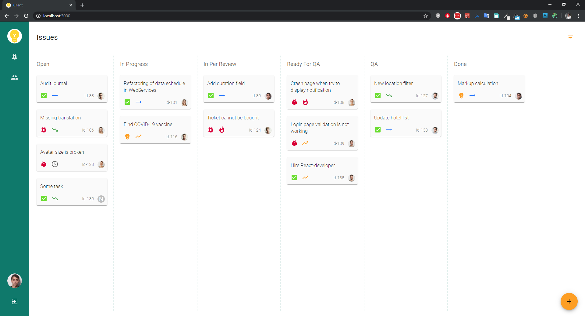
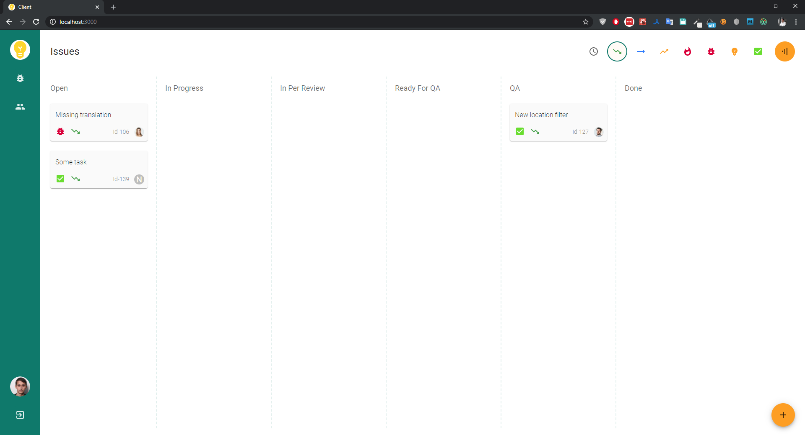
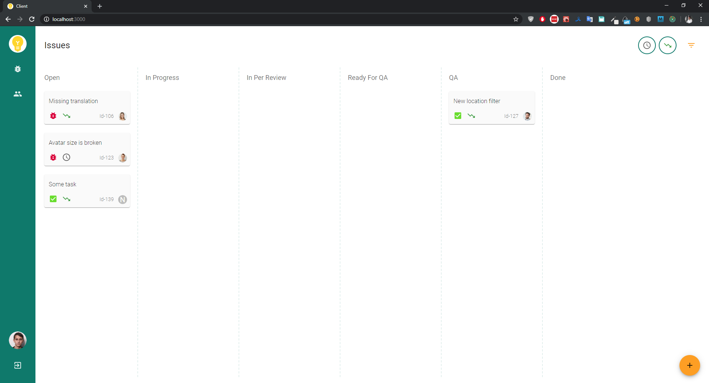
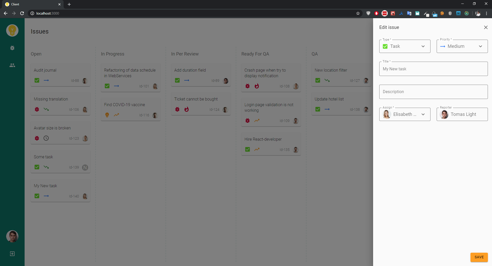

# Issue-Tracker client-side application

Issue-Tracker app consists of two projects:
* [issue-tracker-api](https://github.com/TomasLight/issue-tracker-api)
* [issue-tracker-client](https://github.com/TomasLight/issue-tracker-client)

###  Demo

App interface implementation

###  Youtube video
[Youtube](https://youtu.be/zve6vxPFMuQ)

###  Screenshots
##### Issue page

##### Filter issues

##### Create issue

##### Edit issue

